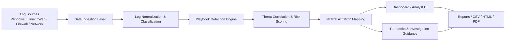
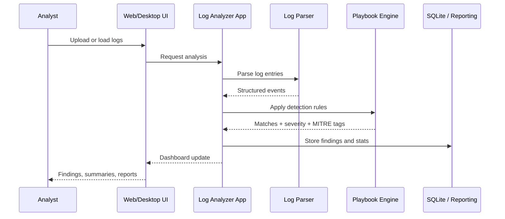

<div align="center">

# 🛡️ Log Analyzer

### Security log intelligence, playbook detection, and forensic reporting

**A Python-powered security analytics platform for SOC workflows, threat detection, and forensic investigation.**
It ingests logs from multiple platforms, applies structured playbook logic, correlates events to MITRE ATT&CK patterns, and produces actionable investigation reports from raw security telemetry.

<br/>


</div>

---

> [!IMPORTANT]
> This platform is intended for defensive security monitoring, authorized log review, and incident investigation. It should be used strictly in accordance with organizational policy, compliance requirements, and lawful operational scope.

---

## ✨ What it does

| | |
|---|---|
| 🔐 **Threat detection** | Correlates authentication failures, privilege escalation attempts, web exploitation, reconnaissance, malware delivery, and exfiltration patterns from live or historic log data. |
| 🧠 **MITRE ATT&CK mapping** | Maps suspicious events to known adversary behaviors and tactics using structured playbook metadata and detection categories. |
| 📊 **Multi-source log support** | Handles Windows Event Logs, Linux/macOS system logs, Apache/Nginx/IIS logs, DNS, proxy, Fortinet, and OSFC-style telemetry. |
| 🧩 **Playbook engine** | Uses JSON-based playbooks and runbooks to drive detection logic across multiple platforms and attack classes. |
| 🖥️ **Dual interface model** | Provides both browser-based analysis and a desktop launcher for local collection and review. |
| 📄 **Reporting** | Produces CSV, HTML, and PDF summaries for analysts, responders, and stakeholders. |

---

## 🚀 Quick start

```bash
# 1. create a virtual environment
python -m venv .venv
source .venv/bin/activate        # Linux/macOS
# .venv\Scripts\activate         # Windows

# 2. install dependencies
pip install --upgrade pip
pip install flask werkzeug plotly watchdog reportlab

# 3. run the project
python run_portable.py
# or
python Launcher.py
# or
python Log_Analyzer.py
```

Open the application in a browser at:

```text
http://localhost:5000
```

> The portable launcher automatically detects the active playbook scope and starts the tool in the appropriate mode.

---

## ✅ Requirements

| Component | Notes |
|---|---|
| **Python 3.10+** | Required runtime |
| **pip** | Dependency installation |
| **Flask** | Web dashboard and request handlers |
| **Plotly** | Graphs and visual summaries |
| **Watchdog** | File monitoring support |
| **ReportLab** | PDF generation |
| **SQLite** | Local log and report database storage |
| **Windows / Linux / macOS** | Cross-platform execution support |

---

## ⚙️ Configuration

The application reads runtime settings from [`config.json`](config.json) and supports playbook selection through environment variables such as:

- `ACTIVE_PLAYBOOK_TYPES`
- `ACTIVE_PLAYBOOK_TYPE`

Example configuration:

```json
{
  "enabled_playbooks": [],
  "watch_directories": ["uploads"],
  "analysis_settings": {
    "enable_real_time": true,
    "batch_size": 100,
    "analysis_interval": 5
  },
  "report_settings": {
    "auto_generate": true,
    "format": "pdf",
    "output_directory": "reports"
  },
  "web_interface": {
    "host": "0.0.0.0",
    "port": 5000,
    "debug": false
  }
}
```

This configuration layer allows the app to tailor detection scope and reporting behavior based on the deployment or monitoring environment.

---

## 📂 Repository layout

```text
.
├── Log_Analyzer.py              # Core Flask app and analysis engine
├── Launcher.py                  # GUI launcher for web and desktop modes
├── LogCollector_GUI.py          # Desktop log collection interface
├── run_portable.py              # Portable startup entry point
├── start_portable.sh            # Shell-based launcher
├── deployment_helper.py         # Deployment assistance utilities
├── diagnose_view_rules.py       # Playbook diagnostics
├── playbooks.json               # Primary playbook definitions
├── playbooks_windows.json       # Windows event rules
├── playbooks_linux.json         # Linux event rules
├── playbooks_mac.json           # macOS event rules
├── playbooks_apache.json        # Apache log patterns
├── playbooks_nginx.json         # NGINX log patterns
├── playbooks_iis.json           # IIS log patterns
├── playbooks_dns.json           # DNS patterns
├── playbooks_proxy.json         # Proxy and firewall rules
├── playbooks_fortinet.json      # Fortinet detection logic
├── playbooks_syslog.json        # Syslog handling rules
├── playbooks_osfc.json          # OSFC-related rules
├── playbook_selector_modal.html # UI modal for playbook selection
├── runbooks.json                # Response guidance for matched playbooks
├── config.json                  # Runtime configuration
├── uploads/                     # Uploaded log files and artifacts
├── reports/                     # HTML / CSV / PDF output files
├── logs.db                      # SQLite database for collected records
├── sample_ocfs.log              # Sample data source
├── README.md                    # Project documentation
├── .git/                        # Repository metadata
└── __pycache__/                 # Python cache files
```

---

## 🔄 How it works

The system follows a standard security-analysis lifecycle:

1. **Log ingestion** — event data is imported from files, system sources, or desktop collection workflows.
2. **Normalization** — records are classified by source, type, severity, and time window.
3. **Detection** — the playbook engine checks for known malicious or suspicious patterns.
4. **Correlation** — events are grouped by user, host, IP, service, and time to reveal attack sequences.
5. **Mapping** — matched incidents are linked to ATT&CK-style categories and operational guidance.
6. **Reporting** — findings are presented through the dashboard and exported as security reports.

This makes the project useful both for continuous monitoring and post-incident investigation.

---

## 🧱 Architecture



### Request lifecycle



### Layer responsibilities

| Layer | Responsibility |
|---|---|
| Input layer | Reads logs from files, local systems, and desktop collection sources |
| Parsing layer | Normalizes timestamps, severities, sources, and event categories |
| Detection layer | Applies playbook logic across authentication, web, network, and privilege misuse scenarios |
| Correlation layer | Connects related events and identifies suspicious sequences |
| Intelligence layer | Maps behaviors to ATT&CK-style tactics and operational context |
| Presentation layer | Renders dashboard summaries and exports investigation reports |

The architecture is intentionally simple and operational: the app focuses on reliable, explainable detection rather than opaque black-box automation.

---

## 🧪 Detection coverage

The project includes detection logic for patterns such as:

- brute-force authentication attempts
- successful logins after repeated failures
- privilege escalation and admin misuse
- unauthorized sudo or root activity
- port scanning and reconnaissance
- SQL injection and XSS patterns in web logs
- suspicious PowerShell execution or malware delivery indicators
- data exfiltration and large outbound transfer events
- firewall intrusion alerts and suspicious SSL or network anomalies
- LDAP enumeration and system access abuse patterns

These are modeled as structured rule sets and mapped to applicable ATT&CK-style technique IDs when relevant.

---

## 🖥️ Using the interface

### Web interface

The browser-based UI supports:

- reviewing security summaries
- checking playbook matches
- sampling risk trends by category
- viewing activity context and findings
- exporting operational reports

### Desktop GUI

The desktop launcher provides local collection and analysis flows for:

- Windows Event Log collection
- Syslog-based inspection
- network connection summaries
- log review and storage in SQLite

---

## 📄 Reporting and evidence output

The application is designed to generate useful operational artifacts such as:

- summary reports
- CSV exports for further analysis
- HTML investigation snapshots
- PDF documents for stakeholder communication

These outputs are especially valuable for SOC handoff, investigation documentation, compliance review, and incident follow-up.

---

## 🛡️ Security and responsible use

This project is intended for:

- internal security monitoring
- defensive analysis
- incident investigation support
- security automation research

It must not be used for unauthorized surveillance, privacy intrusion, or malicious activity. Follow internal policy, legal obligations, and governance requirements before collecting or analyzing log data in production environments.

---

## 🗺️ Roadmap

Planned improvements include:

- a broader and more adaptive playbook library
- enhanced alert correlation and prioritization
- real-time watchers for additional log sources
- richer dashboard visualizations and drill-down views
- stronger deployment packaging and configuration management
- improved export and automation workflows for incident response teams

---

## 🤝 Contributing

Contributions are welcome. If you want to improve playbooks, expand platform coverage, strengthen detection logic, or refine the reporting workflow:

1. Fork the repository
2. Create a feature branch
3. Implement the improvement
4. Submit a pull request with a clear description of the change

---

## ⚖️ Licensing

This repository does not currently include a dedicated license file. Please review repository policy and confirm legal usage constraints before production or commercial deployment.

---

<div align="center">
<sub>Built for defensive security operations, forensic review, and structured threat investigation.</sub>
</div>


<p align="center">
  <strong>Built for security analysis, threat hunting, and proactive log defense.</strong>
</p>
